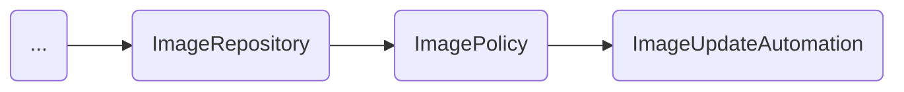
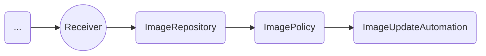
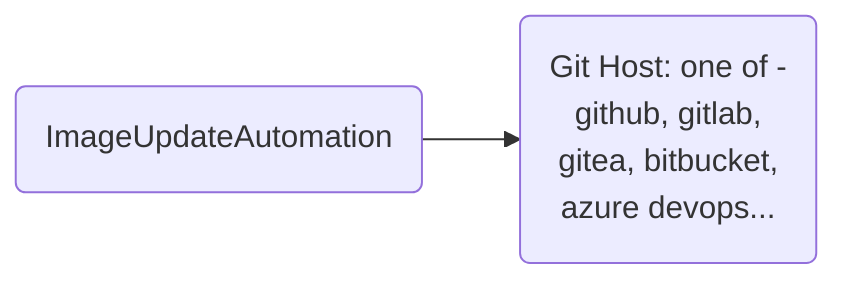

# GitOpsCon EU 2025 (Virtual)

subtitle
:   Let's Talk GitOps Reliability

author
:   Kingdon Barrett

institution
:   Navteca

theme
:   rabbit-theme-wwinternalstyle

date
:   2025-05-28

allotted-time
:   25m

# Push, Wait, ... Nothing?

# Agenda

* Story
* Joke
* Anecdote
* {::wait/}Talk content
* {::wait/}Image Update Automation

# Agenda (pt. 2)

* {::wait/}Flux 2.6
* Roadmap
* What is Flux
* {::wait/}What are the resources in Flux?
* {::wait/}What is a good Flux experience like

# Different ways                                    to arrive at a good experience

# Agenda (pt. 3)

* So, you followed my advice, and something went wrong
* {::wait/}Now what?
* How not to have a bad experience
* {::wait/}Minimal installation vs. Tricked Out

# The Setup

* Just "Git Push" and your changes go in
* {::wait/}Well there's a little more to it than that,
* {::wait/}We might be waiting for some time...

# Two options

# Two options

1. If you don't care about performance

# Two options

1. Don't care about perf (only speed)

* {::wait/}...how bad can performance actually be?

We can sacrifice some:

* {::wait/}CPU
* {::wait/}RAM
* {::wait/}Bandwidth

# Two options

1. ~~Don't care about perf (only speed)~~
2. {::wait/}Let's do this right

* {::wait/}First, some concrete examples:

# YAML becomes stale

```yaml
spec:
  template:
    spec:
      containers:
      - name: sintache
        image: img.hephy.pro/examples/sinatra-mustache:b22.20220712.042140
```

When you write this image tag in your YAML, how does it get updated?

# YAML becomes stale

```yaml
apiVersion: pkg.crossplane.io/v1
kind: Provider
metadata:
  name: provider-aws
spec:
  package: host/repo/provider-aws:v0.52.6 # {"$imagepolicy": "flux-system:provider-aws"}
  controllerConfigRef:
    name: provider-aws-config
```

Add an ImagePolicy marker
(lets Flux know where to update the image tag.)

# ImagePolicy definition

```yaml
apiVersion: image.toolkit.fluxcd.io/v1beta2
kind: ImagePolicy
metadata:
  name: provider-aws
  namespace: flux-system
spec:
  imageRepositoryRef:
    name: provider-aws
  policy:
    semver:
      range: 0.x # (Among other sorting strategies: Alphabetical, Numerical)
```

Flux knows SemVer.
Recommend SemVer for production targets.

# ImageRepository

```yaml
apiVersion: image.toolkit.fluxcd.io/v1beta2
kind: ImageRepository
metadata:
  name: provider-aws
  namespace: flux-system
spec:
  image: xpkg.upbound.io/crossplane-contrib/provider-aws # Scans & mirrors Image Tag lists from here
  interval: 30m
```

# Interval

```yaml
spec:
  interval: 30m
```

# Interval

```yaml
spec:
  interval: 2m
```

# Interval

```yaml
spec:
  interval: 10s
```

* {::wait/}don't do this, not when performance matters
* {::wait/}(set up a `Receiver` instead!)

# Subscription


# Subscription?



# Receiver's Role



# ImageUpdateAutomation

```yaml
apiVersion: image.toolkit.fluxcd.io/v1beta2
kind: ImageUpdateAutomation
metadata:
  name: xplane-updater
  namespace: flux-system
spec:
  interval: 30m
  sourceRef:
    kind: GitRepository
    name: image-auto-gitrepo # This repository's secretRef deploy key has write access
  git:
    checkout:
      ref:
        branch: main
    commit:
      author:
        email: fluxcdbot@git.your.company.com
        name: fluxcdbot
      messageTemplate: |
        Crossplane Providers: Automated image update

        Automation name: {{ .AutomationObject }}
```

# ImageUpdateAutomation (pt. 2)

```yaml
...
      messageTemplate: |
        Crossplane Providers: Automated image update

        Automation name: {{ .AutomationObject }}

        ```
        Files:
        {{ range $filename, $_ := .Changed.FileChanges -}}
        - {{ $filename }}
        {{ end -}}

        Objects:
        {{ range $resource, $changes := .Changed.Objects -}}
        - {{ $resource.Kind }} {{ $resource.Name }}
          Changes:
        {{- range $_, $change := $changes }}
            - {{ $change.OldValue }} -> {{ $change.NewValue }}
        {{ end -}}
        {{ end -}}
        ```
    push:
      branch: xplane-updater
      options:
        merge_request.create: ""   # special options for GitLab
        merge_request.target: main
  update:
    path: ./deploy/staging/crossplane-providers
    strategy: Setters
```


# Outside the Cluster



# Subscription


# Subscription

# Watchers

There are broadly two types of resources:

1. {::wait/}Connects to outside
   (`GitRepository`, `OCIRepository`, `Bucket`, `HelmChart`, `HelmRepository`)

* {::wait/}Let's call them sources

# Watchers

* except not all of these are in Source API (`ImageRepository`, ...)

# Watchers

1. Connects to outside (`GitRepos`, ...)
2. {::wait/}Connects to another Flux resource

* {::wait/}^ These can be automatically subscribed

# Watchers

1. Connects to outside (`GitRepos`, ...)
2. Connects to another Flux resource
3. {::wait/}Resources with no reconciler

# Third kind

* Resources with no reconciler
(`Alert`, formerly `ImagePolicy`)

# Question

So what happens if I set

```yaml
spec.interval: 30m
```

on every resource
(of those that have a reconciler?)

# Talk Content


