# GitOpsCon EU 2025 (Virtual)

subtitle
:   Let's Talk GitOps Reliability

author
:   Kingdon Barrett

institution
:   Navteca

theme
:   rabbit-theme-wwinternalstyle

date
:   2025-05-28

allotted-time
:   25m

# Push, Wait, ... Nothing?

# Agenda

* Story
* Joke
* Anecdote
* {::wait/}Talk content
* {::wait/}Image Update Automation

# Joke

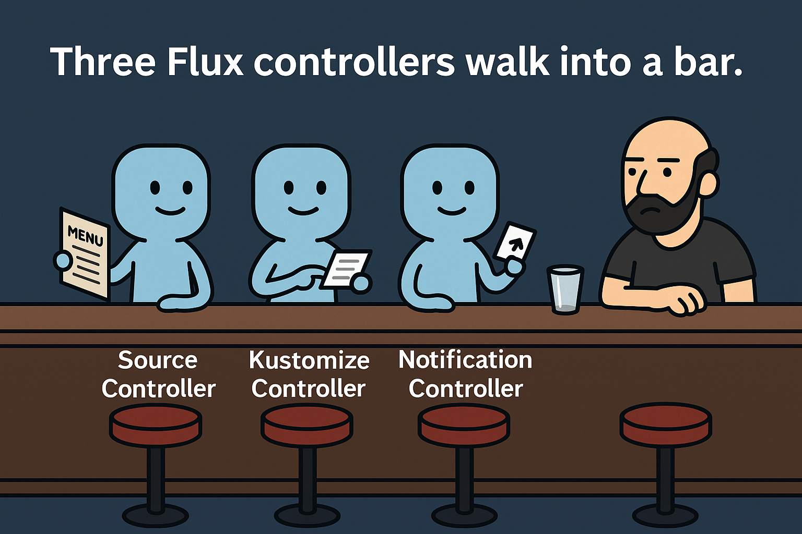{:
  relative_height="100"
}

# Slides

Slides are Markdown, with Rabbit-Shocker (Ruby)

* Sorry - Lots of slides, I might go too fast
([https://github.com/kingdonb/gitopscon2025-slides][slides repo]) or run out of time!

Welcome to clone & follow along during the talk, read ahead, etc.

[slides repo]: https://github.com/kingdonb/gitopscon2025-slides

# Agenda (pt. 2)

* {::wait/}Flux 2.6
* Roadmap ([fluxcd.io/roadmap][roadmap])
* What is Flux
* {::wait/}What resources are in Flux?
* {::wait/}What is a good Flux experience like

[roadmap]: fluxcd.io/roadmap

# Different ways                                    to arrive at a good experience

# Agenda (pt. 3)

* So, you followed my advice, and something went wrong
* {::wait/}Now what?
* {::wait/}How not to have a bad experience

# The Setup

* Just "Git Push" and your changes go in
* {::wait/}Well there's a little more to it than that,
* {::wait/}We might be waiting for some time...

# Two options

# Two options

* {::wait/}Minimal installation vs. Tricked Out
* {::wait/}*RICE*:
  Race Inspired Cosmetic Enhancement

# RICE

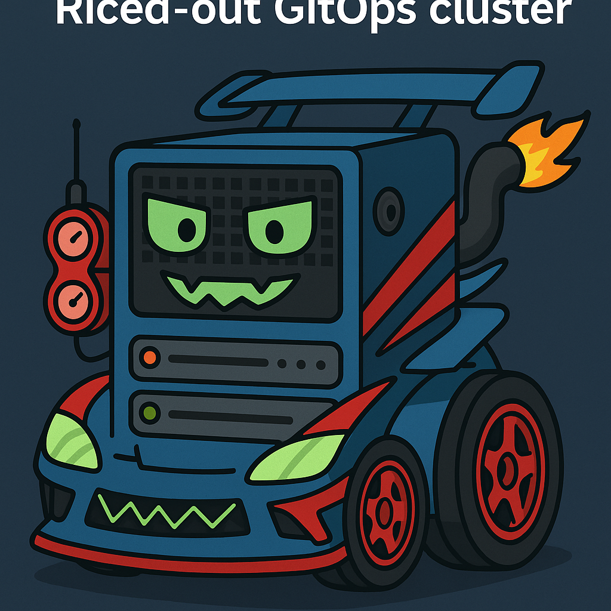{:
  relative_height="100"
}


# Two options

* It's not "ricing" it's just properly configured
* *RICE*:
  Race Inspired Cosmetic Enhancement
* {::wait/}Goal is for devs to be able to move fast

# Protip

* How do you know if your change went in?
* {::wait/}`flux get kustomizations`
* {::wait/}`flux get sources git`
* {::wait/}`flux get ...` install a UI
* {::wait/}Give up `(┛ಠ_ಠ)┛彡┻━┻`

# Protip

* Give up `(┛ಠ_ಠ)┛彡┻━┻`
* {::wait/}Or, just set up Notifications!
  [fluxcd.io/flux/monitoring/alerts/][alerts]

# Instant Feedback

# Instant Feedback

* Know right away when something went wrong - shorten the feedback loop
* {::wait/}*Key:* instant
* {::wait/}Delays impose cognitive overhead
* {::wait/}If you thought polling was wasteful before,
  ...

# Instant Feedback

* If you thought polling was wasteful before, try polling by hand!
* {::wait/}`flux reconcile ...` is an anti-pattern
* {::wait/}Delays, context switches impose
  *cognitive overhead*,
* leads to overload, eventually burnout
* {::wait/}Notifications & Receivers *help devs*

# Alerts

* We all need a little help sometimes
* We won't cover setting up alerts today
* [youtu.be/zrSUjAXF0xA][alerts-talk] - KubeCon Talk about Flux Obsv. by Somtochi in 2023
* {::wait/}(But do set up alerts though!)
  20+ supported providers
* {::wait/}Teams, Mattermost, Discord, Telegram, ...
  many others (get notified where you are!)

[alerts]: fluxcd.io/flux/monitoring/alerts/
[alerts-talk]: youtu.be/zrSUjAXF0xA

# Shorten Feedback Loops

* Notifications & Receivers
  help devs to *iterate fast*
  with no extra steps!
* {::wait/}*Surprise and Delight* devs with good DX
* {::wait/}Have the joyful experience, don't skip this
* {::wait/}Avoid pain/misery and *inevitable RSI*

# Two options

1. If you don't care about performance

* {::wait/}Maybe you are running Flux in Kind
* {::wait/}On your laptop, this is good
* {::wait/}(This is not the way in Production)
* {::wait/}or in any permanent environment
* {::wait/}which devs are using actively

# Two options

1. Don't care about perf (only speed)

* {::wait/}is that a contradiction?
...how bad can performance actually be?

We can sacrifice some:

* {::wait/}CPU
* {::wait/}RAM
* {::wait/}Bandwidth - to avoid configuration hassle

# Two options

1. ~~Don't care about perf (only speed)~~
   these things do have a cost,
   Using Cloud, it adds up quickly!
2. {::wait/}Let's do this right

* {::wait/}First, some concrete examples:

# YAML becomes stale

A problem that Flux solves:

```yaml
spec:
  template:
    spec:
      containers:
      - name: sintache
        image: img.hephy.pro/examples/sinatra-mustache:b22.20220712.042140
```

When you write this image tag in your YAML, how does it get updated?

# YAML becomes stale

Flux solution:

```yaml
apiVersion: pkg.crossplane.io/v1
kind: Provider
metadata:
  name: provider-aws
spec:
  package: host/repo/provider-aws:v0.52.6 # {"$imagepolicy": "flux-system:provider-aws"}
  controllerConfigRef:
    name: provider-aws-config
```

Add an ImagePolicy marker
(lets Flux know where to update the image tag.)

# ImagePolicy definition

```yaml
apiVersion: image.toolkit.fluxcd.io/v1beta2
kind: ImagePolicy
metadata:
  name: provider-aws
  namespace: flux-system
spec:
  imageRepositoryRef:
    name: provider-aws
  policy:
    semver:
      range: 0.x # (Among other sorting strategies: Alphabetical, Numerical)
```

Flux knows SemVer.
Recommend SemVer for production targets.

# ImageRepository

```yaml
apiVersion: image.toolkit.fluxcd.io/v1beta2
kind: ImageRepository
metadata:
  name: provider-aws
  namespace: flux-system
spec:
  image: xpkg.upbound.io/crossplane-contrib/provider-aws # Scans & mirrors Image Tag lists from here
  interval: 30m
```

# Interval

30 minutes is fine when it's externally sourced

```yaml
spec:
  interval: 30m
```

# Interval

Active Dev should not wait longer than 5m

```yaml
spec:
  interval: 2m
```

# Interval

Faster the better - but polling has limits!

```yaml
spec:
  interval: 10s
```

* {::wait/}Protip: don't do this when perf matters (cost)
* {::wait/}Set up a `Receiver` instead!

# Subscription

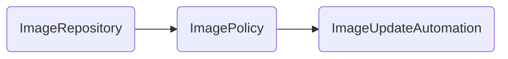

# Subscription?

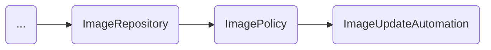

# Receiver's Role

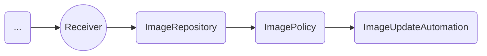

# ImageUpdateAutomation

```yaml
apiVersion: image.toolkit.fluxcd.io/v1beta2
kind: ImageUpdateAutomation
metadata:
  name: xplane-updater
  namespace: flux-system
spec:
  interval: 30m
  sourceRef:
    kind: GitRepository
    name: image-auto-gitrepo # This repository's secretRef deploy key has write access
  git:
    checkout:
      ref:
        branch: main
    commit:
      author:
        email: fluxcdbot@git.your.company.com
        name: fluxcdbot
      messageTemplate: |
        Crossplane Providers: Automated image update

        Automation name: {{ .AutomationObject }}
```

# ImageUpdateAutomation (pt. 2)

```yaml
...
      messageTemplate: |
        Crossplane Providers: Automated image update

        Automation name: {{ .AutomationObject }}

        ```
        Files:
        {{ range $filename, $_ := .Changed.FileChanges -}}
        - {{ $filename }}
        {{ end -}}

        Objects:
        {{ range $resource, $changes := .Changed.Objects -}}
        - {{ $resource.Kind }} {{ $resource.Name }}
          Changes:
        {{- range $_, $change := $changes }}
            - {{ $change.OldValue }} -> {{ $change.NewValue }}
        {{ end -}}
        {{ end -}}
        ```
    push:
      branch: xplane-updater
      options:
        merge_request.create: ""   # special options for GitLab
        merge_request.target: main
  update:
    path: ./deploy/staging/crossplane-providers
    strategy: Setters
```

# Outside the Cluster

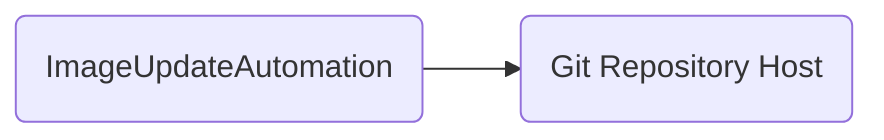

one of
github, gitlab,
gitea, bitbucket,
azure devops...

# Subscription

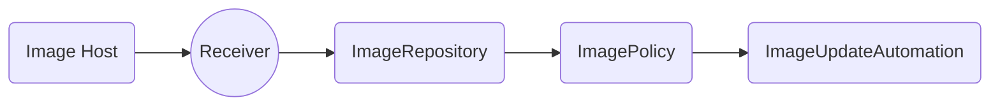

# Subscription

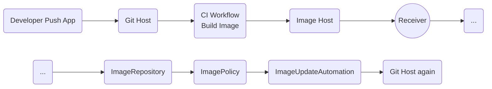

# Subscription


# Subscription

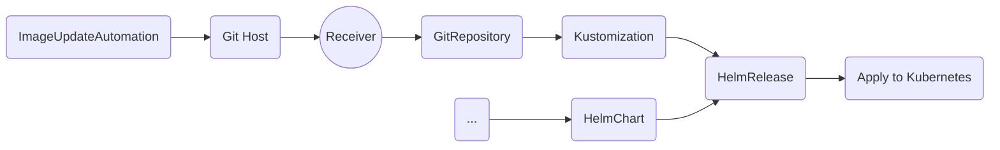

# Watchers

There are broadly two types of resources:

1. {::wait/}Connects to outside
   (`GitRepository`, `OCIRepository`, `Bucket`, `HelmChart`, `HelmRepository`)

* {::wait/}Let's call them sources

# Watchers

* except not all of these are in Source API (`ImageRepository`, ...)
* {::wait/}Outside of Kubernetes, automatic subscription is not possible
* {::wait/}(well, GitLab Agent manages it, but Flux natively does not support this capability)

# GitLab user?

* Install GitLab Agent, then have a soda!

Easy, single command to get this working
Subscribe every GitRepository automatically

* {::wait/}...but most of us are on GitHub
* {::wait/}I am on GitLab, I couldn't get this working
* {::wait/}Something wrong with my ELB, doesn't support websocket connection upgrade

# Watchers

Back to native Flux solutions that are
available for practically every Source kind

* {::wait/}Even unsupported Git & Image Repos
can
use `Generic` type of `Receiver`
or `Generic+HMAC` type for better security

# Watchers

*Two* primary Flux types

1. Source: Connects to outside (Git, ...)
2. {::wait/}Applier: Refers to another Flux resource (upstream) and applies sth. to the cluster

*Sources* and *Appliers* transact via *Artifacts*

* {::wait/}Appliers can be automatically subscribed to their source, supported by Kubernetes

# Watchers

1. Connects to outside (`GitRepos`, ...)
2. Connects to another Flux resource
3. {::wait/}Resources with no reconciler

# Third kind

* Resources with no reconciler
(`Alert`, `ImagePolicy`, ...)

* {::wait/}Roadmap shout out: Flux 2.6 adds
long-awaited digest hash pinning
[image-reflector-controller#368][digest-pinning]
so you can use `:latest` in `ImageUpdateAutomation`!

[digest-pinning]: https://github.com/fluxcd/image-reflector-controller/pull/368

# Third kind

* {::wait/}(so now `ImagePolicy` *will have* a reconciler!)
* {::wait/}`Alert` is not reconciled
* {::wait/}Most Flux resources *are* reconciled
* {::wait/}All reconcilers have a *sync interval*

# Question

Experiment:

*So if most subscriptions are automatic* and for those that aren't,
for resources outside the cluster...
I set up `Receivers` and Webhooks

```yaml
spec.interval: 30m
```

# Question

Experiment:

Then why not just

```yaml
spec.interval: 30m
```

# Question

Experiment:

Then why not just

```yaml
spec.interval: 3000m
```

# Talk Content

What could possibly go wrong?

# Receivers

How do they work?

[fluxcd.io/flux/guides/webhook-receivers/][receivers]

[receivers]: fluxcd.io/flux/guides/webhook-receivers/

# Receivers

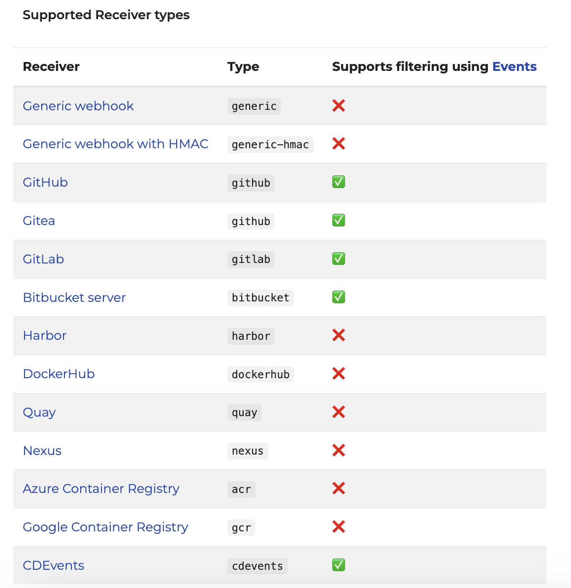{:
  relative_height="110"
  relative_margin_top="-10"
}

# Receiver Example

```yaml
apiVersion: notification.toolkit.fluxcd.io/v1
kind: Receiver
metadata:
  name: flux-system
  namespace: flux-system
spec:
  interval: 24h
  type: gitlab
  events:
    - "Push Hook"
    - "Tag Push Hook"
  secretRef:
    name: webhook-token
  resources:
    - kind: GitRepository
      name: flux-system
```

# Receiver Example

```yaml
kind: Receiver
spec:
  interval: 24h
```

What does that do?
It: reconciles the Receiver with its `Secret` ref

# Receiver Example

```
$ kubectl get receivers
NAMESPACE     NAME          AGE   READY
    STATUS
flux-system   flux-system   60m   True
    Receiver initialized for path: /hook/0484d42e9aabbc852430a12d4c9df4e9abf0fad60c439424b9a7ff46ff9da9e9
flux-system   team-a        60m   True
    Receiver initialized for path: /hook/f70c568a6cd6d8bf7627139108c88e13bc813f952acba48425b0c16dbf2280b7
```

* Hook URL is a hash generated based on your `secretRef` token
* It should be stable until the secret is rotated

# What can go wrong?

* `Receiver` Secret might not match!
* Webhook might not be configured at all
* Config can be deleted
* {::wait/}Protip: build Receivers and Webhooks *using IaC* like Terraform, Pulumi, Crossplane for repeatable experience

# What can go wrong?

* Protip: use External Secrets controller (now supports 1password! and AWS Secrets Manager, and many others)
* {::wait/}Great combination with Crossplane and other IaC tooling
* {::wait/}Easy secret rotation for compliance purposes

# What can go wrong? Receiver

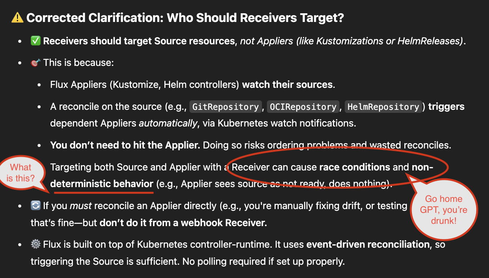{:
  relative_height="110"
  relative_margin_top="-5"
}

# What can go wrong? Receiver

*Lots* can go wrong
even with correctly configured Receiver

* *User Error* is the most common error
* {::wait/}*Solar flare-induced errors* are
  exceedingly rare by comparison

# How to detect config-related failure

POST to Probe `Receiver` endpoint periodically with a synthetic payload

* {::wait/}*Wait a second* isn't that just polling with way more steps? *Yeah...* it is that.
* Probably don't need to monitor this, your devs will let you know it's broken
* {::wait/}But what if I am dev? *Monitor Everything*

# How to detect ingress failure

Probe `Receiver` endpoint periodically

* {::wait/}*You could* hit the `/hook/...` URL
  with a GET request, no payload
  `400` response is good news
* {::wait/}This will not trigger the `Receiver`, but it will likely catch the 80% of failure modes

# What can go wrong?

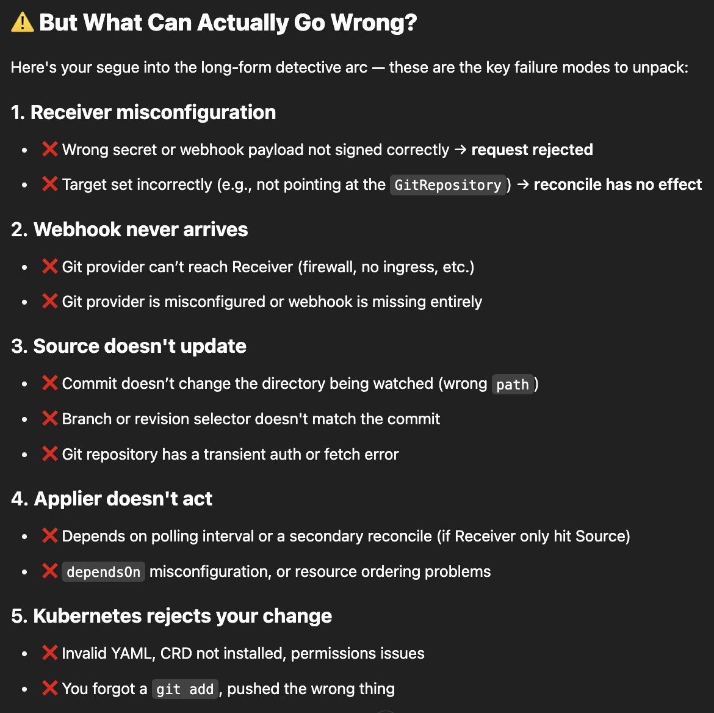{:
  relative_height="110"
  relative_margin_top="-5"
}

# How to detect failure

* But what if I am *the only* dev?
  *Monitor Everything* especially then
* It could be *days* until you notice it's broken
* {::wait/}Who knows if you will *remember*
  *what* you changed (remember: shorten
  feedback loops! *avoid burnout*)

# What can go wrong? Notifications

* Monitor logs to detect when notifications are failing to fire
* {::wait/}If your notifications are down, *how* do you get notified about that?
* {::wait/}*Curate and use a secondary system*
* {::wait/}CloudWatch alerts don't flow through Flux

# What can go wrong? Notifications

* I'm using *EKS Auto Mode*, it deletes my nodes every day & then Flux spews errors, rendering alerts significantly *less useful*
* How do I get Flux Alerts that are *actually useful*, not noisy?
* {::wait/}That is tough, not enough time today

# How do I get useful alerts?

* ...but: Karpenter generates K8s events
  *Monitor those events too*
* You can even route them through Flux Alerts, but this is *advanced wizardry*
* {::wait/}I built *`flux-event-relay`* to send *Karpenter* `NodeClaim` events to Flux
* {::wait/}My *work for hire* (not published as of yet)
but if enough people ask me about it I will

# Thanks

*Questions?* Meet me *`@KingdonB`* on the CNCF Slack, Kubernetes Slack, or find me
at *Flux Bug Scrub*
_


Calendar: [fluxcd.io/community#meetings][meetings]
_

Join the Flux Dev meetings
(We're friendly folks, inclusive community!)

[meetings]: fluxcd.io/community#meetings
